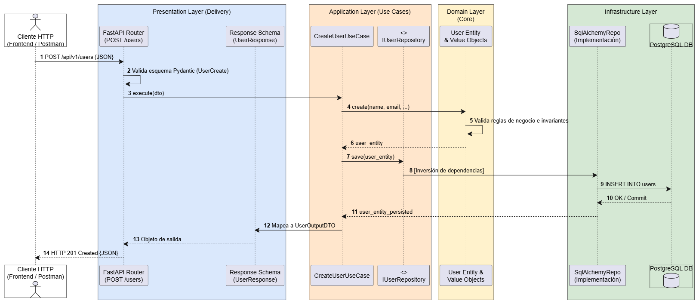

# Análisis sobre el Repositorio de Clean Code

## 1. Flujo Teórico de una Petición en Clean Architecture

Clean Architecture (Arquitectura Limpia), propuesta por Robert C. Martin ("Uncle Bob"), plantea un modelo de diseño de software desacoplado cuyo objetivo primordial es aislar las reglas de negocio de los detalles técnicos, tales como frameworks web, bases de datos, librerías externas o interfaces de usuario.

La Regla de Dependencia (The Dependency Rule)
El diseño arquitectónico se organiza conceptualmente en círculos concéntricos. La regla principal que rige todo el sistema dicta lo siguiente:

"Las dependencias del código fuente únicamente pueden apuntar hacia adentro, en dirección hacia el nivel de mayor abstracción (el Dominio)."

Nada dentro de un círculo interno puede poseer conocimiento alguno de lo que existe en los círculos exteriores. En consecuencia, los componentes de dominio y aplicación no importan clases, anotaciones ni librerías vinculadas a la infraestructura, al framework web o al motor de base de datos.

Ciclo de Vida Teórico de una Petición
Cuando un cliente o sistema externo genera una solicitud (por ejemplo, una petición HTTP), el procesamiento atraviesa de forma secuencial las siguientes fases:

Entrada por la Periferia (Mecanismo de Entrega / Delivery)
La solicitud física llega a través de un mecanismo del círculo más externo (como un servidor web HTTP, una cola de mensajería o una interfaz CLI). Un controlador o router, ubicado en la capa de adaptadores de interfaz (Interface Adapters), intercepta la petición entrante. Su responsabilidad consiste en validar la sintaxis formal del payload (tipos de datos y estructura) y transformar dicha información en un objeto neutral de transferencia de datos conocido como DTO (Data Transfer Object) o Command.

Cruce de Frontera hacia la Aplicación (Application Layer)
El controlador invoca el Caso de Uso (Use Case / Interactor) correspondiente y le suministra el DTO de entrada. El caso de uso contiene la lógica específica de la aplicación: define y orquesta la secuencia de pasos necesarios para cumplir con el requerimiento del cliente sin tomar decisiones sobre cómo se almacena o cómo se muestra la información.

Ejecución de Reglas de Negocio Centrales (Domain Layer)
El Caso de Uso instancia o interactúa con las Entidades de Dominio y los Value Objects. En este nivel residen las reglas de negocio críticas e invariantes, que son aquellas restricciones y cálculos que rigen el negocio con total independencia de si el sistema está automatizado en software o no. Las entidades validan su consistencia interna y retornan el estado de negocio procesado hacia el caso de uso.

Persistencia y Comunicación Externa mediante Inversión de Dependencias (DIP)
Cuando el Caso de Uso necesita persistir los cambios o comunicarse con servicios externos (base de datos relacional, servicio de correos, cache), no invoca implementaciones concretas ni drivers de infraestructura. En su lugar, utiliza una interfaz o contrato abstracto (denominado comúnmente Puerto o Repository Interface) declarado dentro de las capas internas.
En tiempo de ejecución entra en acción el Principio de Inversión de Dependencias (DIP): una clase concreta ubicada en la capa externa de Infraestructura implementa dicho contrato y ejecuta las sentencias reales hacia la base de datos. De esta forma, el flujo de control viaja hacia la persistencia física, pero la dependencia del código fuente apunta hacia adentro, hacia el contrato abstracto del caso de uso.

Empaquetado y Retorno de Salida (Presenters / Response)
Una vez confirmada la operación de persistencia, el Caso de Uso empaqueta los resultados en un DTO de salida (OutputDTO), evitando exponer las entidades del dominio de forma directa a los clientes. El adaptador de presentación (controlador o presenter) toma el DTO de salida, lo formatea al estándar de entrega correspondiente (como una respuesta HTTP con formato JSON y código de estado 200 OK o 201 Created) y lo envía de regreso al cliente.

Relación entre Flujo de Control y Dirección de Dependencias
Flujo de Control en Ejecución: Cliente -> Controlador / Router -> Caso de Uso -> Entidad de Dominio -> Repositorio de Infraestructura -> Base de Datos.

Dirección de Dependencias en el Código: El Controlador depende del Caso de Uso; el Caso de Uso depende de la Entidad y de la Interfaz del Repositorio; la Implementación de Infraestructura depende de la Interfaz del Repositorio. Toda dependencia converge hacia el centro de la arquitectura.

## 2. Identificar si estan presentes las capas que plantea la arquitectura

Estructura de Capas Identificada
Capa de Dominio (Domain Layer - Entidades y Reglas de Negocio Centrales)

Ubicación en el repositorio: Carpetas domain/ (por ejemplo, en los módulos de negocio o dentro del paquete central de la aplicación).

Componentes presentes: Entidades de negocio puras, Value Objects (objetos de valor) y excepciones de dominio personalizadas.

Evidencia de cumplimiento: Los modelos de esta capa están construidos mediante clases estándar de Python (dataclasses o clases planas sin acoplamiento a librerías de infraestructura). No importan FastAPI, SQLAlchemy, ni decoradores de bases de datos. Contienen únicamente lógica e invariantes del negocio.

Capa de Aplicación (Application Layer - Casos de Uso / Orquestación)

Ubicación en el repositorio: Carpetas application/ o use_cases/.

Componentes presentes: Clases de Casos de Uso (como creación, consulta o actualización de entidades), Data Transfer Objects (DTOs) para entrada/salida y las interfaces abstractas de los repositorios (Protocols o clases base abstractas ABC).

Evidencia de cumplimiento: La lógica de orquestación reside aquí. Esta capa declara contratos como IUserRepository, definiendo los métodos que necesita para persistir datos pero sin implementar cómo se conecta la base de datos, cumpliendo estrictamente con el principio de Inversión de Dependencias.

Capa de Adaptadores de Interfaz / Presentación (Interface Adapters / Presentation)

Ubicación en el repositorio: Carpetas presentation/, api/ o routers de FastAPI.

Componentes presentes: Controladores de rutas (APIRouter), esquemas de validación de entrada/salida (modelos Pydantic para HTTP Request/Response) y funciones de inyección de dependencias (Depends()).

Evidencia de cumplimiento: FastAPI se utiliza exclusivamente como un mecanismo de transporte (delivery mechanism). Esta capa recibe la petición HTTP, la valida con Pydantic, llama al caso de uso correspondiente y serializa el DTO resultante en un formato JSON adecuado para el cliente.

Capa de Infraestructura (Infrastructure Layer - Frameworks y Drivers)

Ubicación en el repositorio: Carpetas infrastructure/.

Componentes presentes: Modelos relacionales ORM (tablas de SQLAlchemy), configuración del motor y sesiones de base de datos (PostgreSQL), migraciones con Alembic y la implementación concreta de los repositorios.

Evidencia de cumplimiento: Las clases como SqlAlchemyUserRepository heredan o implementan los contratos abstractos definidos en la capa de aplicación. Son las únicas autorizadas para importar SQLAlchemy o realizar consultas SQL directas, aislando los detalles técnicos del resto del sistema.

| Capa Canónica (Clean Architecture) | Ubicación / Módulo en el Proyecto | Componentes Clave | ¿Presente y Conforme? |
| :--- | :--- | :--- | :--- |
| **Domain (Dominio)** | `*/domain/` | Entidades puras, Value Objects, Excepciones | **Sí** (Sin dependencias externas) |
| **Application (Aplicación)** | `*/application/` | Casos de uso, DTOs, Interfaces de Repositorio | **Sí** (Orquesta sin conocer la DB) |
| **Presentation (Presentación)** | `*/presentation/` o `*/api/` | FastAPI Routers, Pydantic Schemas | **Sí** (Adaptador de entrada HTTP) |
| **Infrastructure (Infraestructura)** | `*/infrastructure/` | SQLAlchemy Models, Implementación de Repositorios, Conexión DB | **Sí** (Detalle técnico desacoplado) |

Veredicto de Cumplimiento
El repositorio cumple satisfactoriamente con los principios de Clean Architecture y DDD (Domain-Driven Design). Se observa una clara separación de responsabilidades:

No existe acoplamiento del framework web hacia el dominio ni hacia los casos de uso.

La persistencia de datos se encuentra totalmente invertida mediante interfaces, lo que permite cambiar el motor de base de datos o el ORM sin necesidad de alterar una sola línea de lógica de negocio o de casos de uso.

## 3. Flujo de una Petición según los Componentes del Proyecto

A continuación se detalla el ciclo de vida completo de una solicitud real en el proyecto, tomando como referencia el caso de uso de creación de un usuario (POST /api/v1/users).

### Diagrama de Secuencia

### Descripción Paso a Paso del Flujo

Recepción HTTP (Presentation Layer / Delivery):

El cliente externo (Postman o aplicación frontend) envía una solicitud POST /api/v1/users con un cuerpo JSON.

El router de FastAPI (APIRouter) intercepta la solicitud.

El esquema de Pydantic (UserCreateRequest) valida los tipos y la sintaxis de los datos entrantes. Si el payload no es válido, FastAPI rechaza la solicitud de inmediato con un error 422 Unprocessable Entity sin tocar la lógica interna.

Inyección de Dependencias:

El sistema de inyección de FastAPI (Depends()) resuelve las dependencias necesarias: instancia la conexión a la base de datos, el repositorio concreto de infraestructura (SqlAlchemyUserRepository) y lo inyecta dentro del caso de uso.

Invocación del Caso de Uso (Application Layer):

El router llama al método principal del caso de uso (CreateUserUseCase.execute()), transfiriéndole los datos de entrada transformados.

El caso de uso inicia la orquestación: verifica condiciones previas (como validar que el email no esté registrado previamente).

Instanciación y Reglas de Dominio (Domain Layer):

El caso de uso crea una instancia de la entidad User o de los Value Objects correspondientes.

La entidad ejecuta sus métodos de validación de negocio e invariantes. Una vez verificado el estado interno de la entidad, el dominio la retorna al caso de uso.

Inversión de Persistencia (Application -> Infrastructure):

El caso de uso invoca el método save(user) del contrato abstracto IUserRepository.

En tiempo de ejecución, la implementación concreta (SqlAlchemyUserRepository) en la capa de Infraestructura recibe la entidad de dominio, la mapea a un modelo ORM relacional de SQLAlchemy y ejecuta la sentencia INSERT INTO en la base de datos PostgreSQL.

La base de datos confirma la transacción (commit) y el repositorio devuelve la entidad persistida (con su ID generado) hacia la capa de aplicación.

Transformación y Respuesta (Application -> Presentation):

El caso de uso empaqueta la información resultante en un DTO neutro (UserOutputDTO), asegurando que ningún detalle del ORM ni del dominio interno quede expuesto.

El endpoint de FastAPI recibe el DTO, lo serializa a través de un esquema de respuesta (UserResponseSchema) y devuelve al cliente una respuesta HTTP 201 Created con el JSON final.

